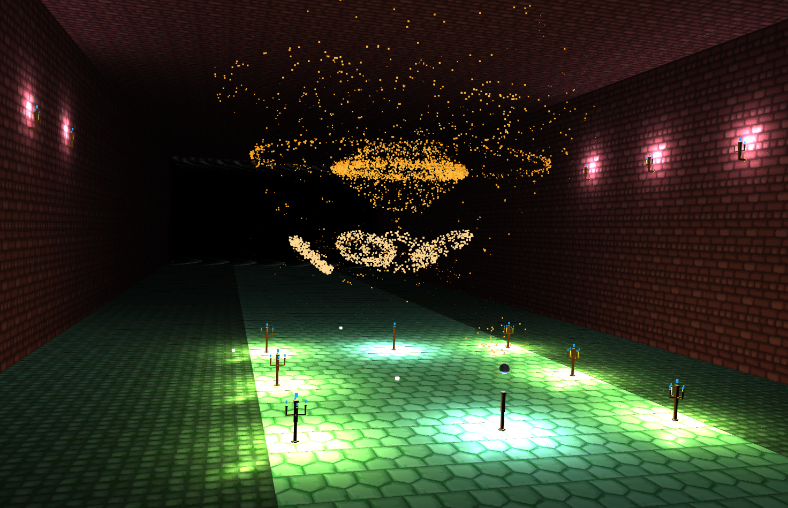
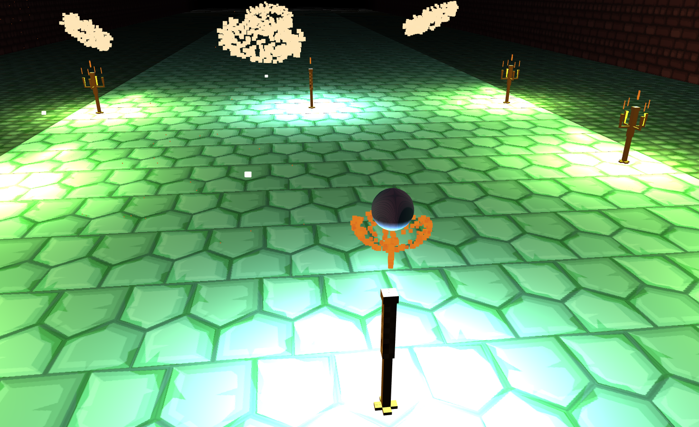

Project 6: Particle Systems
=============================

The Most Ugliest Dungeon Ever. It has some interesting things though!



[Demo Link](https://vasumahesh1.github.io/ParticleSystem_WebGL/)

## Particle System

Unlike the demo, my particle system has a TTL (Time to Live) for each particle.

This is the structure of a particle state:
```typescript
class ParticleState {
  position: vec4;
  orient: vec4;
  color: vec4;
  scale: vec3;
  destination: vec4;

  velocity: vec4;
  ttl: number;
  lifetime: number;
  mesh: string;

  sourcePosition: vec4;
  colorGradient: any;
}
```

Particles are colored and shaped based on the TTL and Lifetime. There is a custom color gradient per `ParticleSource`.

A `ParticleSystem` consists of `ParticleSource`s, `ParticleAttractor`s, `ParticleRepulsor`s.

A `MeshParticleSystem` is a particle system where the attractors are the verticles.

A Torch is made by combining such systems together. There are 3 different torches on the scene. One on the walls and others on the floor.


## Interactivity

Use your Mouse and Keyboard keys to change the scene.

`A` : Adds a temporary attractive force to move particles to where your mouse is.

`S` : Adds a temporary repulsive force to move particles to where your mouse is.

`D` : Adds a source for emitting particles for the TargetMesh (The mesh to which the particles get attracted to) in the scene.

There are some more keys but they are explained below in more detailed.


## Mesh surface attraction

There is a predefined 'Gem' on the scene. To which the particles get attracted to.

I didn't add a dropdown, as I felt my scene needed this as a default. I had other plans to include the gem as a proper 3d mesh and use a sphere maybe surrounding it, but couldn't get time.


## EC: Interactive Mesh Attractors

Interactively you can also place a Sphere Mesh based on where your mouse is using the `F` key.

This will cause the existing sources to randomly send particles to the new Mesh along with the Gem.


## EC: Music

I used HTML5 audio capabilities to get frequency data. MDN has an interesting article on how to make visualizations using Audio. I used the same principle to extract audio information.

If the audio frequency (average) is high, the torches emit Blue Flames instead of red. Also, the torches become dim, if the music is on a lower note / frequency.


## EC ? : Custom Particle Effect

`༼ つ o_o ༽つ`

I had a flame simulation with an Orb on top of the flame. The Orb caused the flame partciles to travese around it rather than through it. It obtained a nice effect.

This can be extended to other objects as long as we can mathematically represent the surface.




## Note:

I tried to build a dungeon with torches emitting fire particles. Guess it turned out too heavy for the CPU side for simulating the particles. I tried instancing the flame particles (they are instanced currently) on the CPU side, meaning I share the same flame simulation per torch. Even, after that it turned out to be quite heavy.

The profiler says that the main issue is the VBO creation for the Particles. There were a couple of other design choices I thought, but couldn't do it in time.

So, ideally the initial couple of minutes will run fine, then for some reason it starts to lag and FPS might drop a bit.

## Improving Performance:

One way I see to improve performance is to use web workers which will parallelize the simulation. Also a better vbo for particles where I don't recreate the instanced position and just merely edit them, but this has to account for the TTL of dead particles etc.

## References:

- [BDcraft Minecraft Textures](bdcraft.net)
- [Audio Visualization](https://developer.mozilla.org/en-US/docs/Web/API/Web_Audio_API/Visualizations_with_Web_Audio_API)
- [Gem Mesh](https://free3d.com/3d-model/colored-diamonds-84118.html)